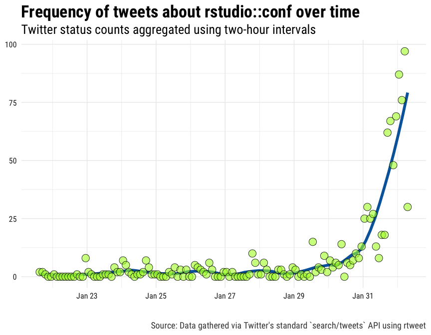
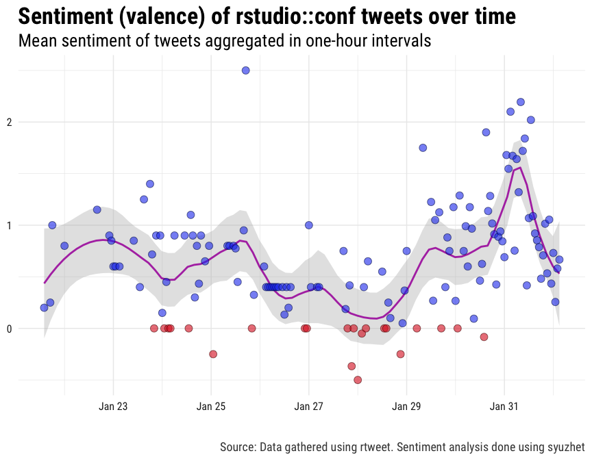
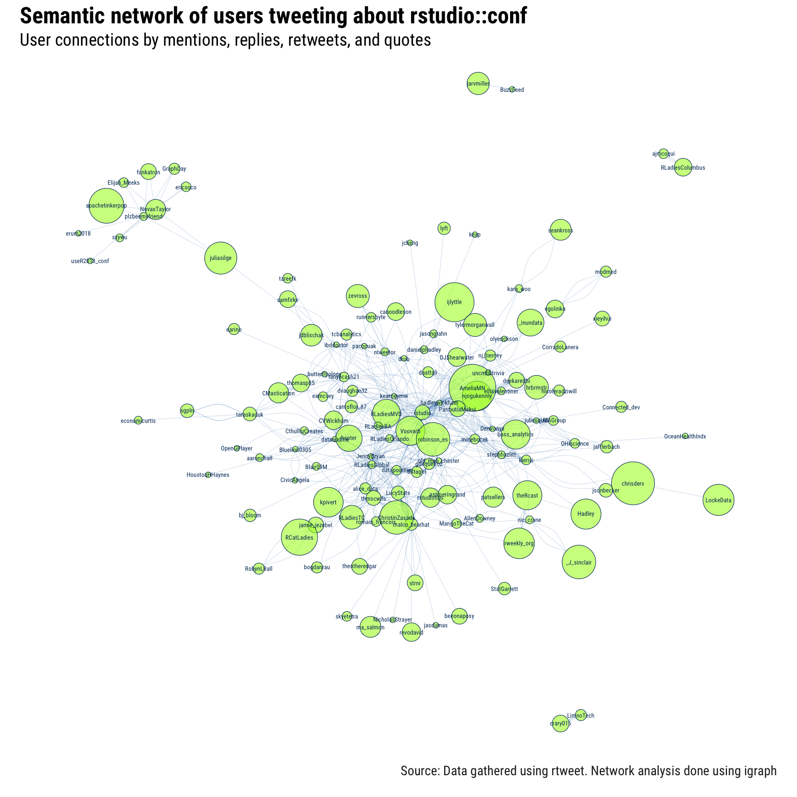

```{r setup, include=FALSE}
knitr::opts_chunk$set(echo = TRUE, collapse = TRUE)
```

# rstudio::conf tweets

A repository for tracking [tweets](https://twitter.com/hashtag/rstudioconf?f=tweets&vertical=default&src=hash) about [rstudio::conf 2018](https://www.rstudio.com/conference/).

## rtweet

To make it easier to request data from Twitter's APIs, install [if it's not already] and load [rtweet](http://rtweet.info).

```{r}
## install rtweet if not already
if (!requireNamespace("rtweet", quietly = TRUE)) {
  install.packages("rtweet")
}

## load rtweet
library(rtweet)
```

## Data

Two data collection methods are described in detail below. Hoewver, if you want to skip straight to the data, run the following code:

```{r, eval=FALSE}
## read status IDs from raw github rds file
ids <- readRDS(
  "https://github.com/mkearney/rstudioconf_tweets/raw/master/data/search-ids.rds")

## lookup data associated with status ids
rt <- rtweet::lookup_tweets(ids)
```

## Stream

There are two easy ways to get Twitter data filtered by one or more keywords. The first way is to stream the data (using Twitter's stream API). For example, in the code below, a stream is setup to run continuously from the moment its executed until the Saturday at midnight (to roughly coincide with the end of the conference).

```{r, eval=FALSE}
## set stream time
timeout <- as.numeric(
  difftime(as.POSIXct("2018-02-04 00:00:00"),
  Sys.time(), tz = "US/Pacific", "secs")
)

## search terms
rstudioconf <- c("rstudioconf", "rstudio::conf", 
  "rstudioconference", "rstudioconference18", 
  "rstudioconference2018", "rstudio18", 
  "rstudioconf18", "rstudioconf2018", 
  "rstudio::conf18", "rstudio::conf2018")

## name of file to save output
json_file <- file.path("data", "stream.json")

## stream the tweets and write to "data/stream.json"
stream_tweets(
  q = paste(rstudioconf, collapse = ","), 
  timeout = timeout,
  file_name = json_file,
  parse = FALSE
)

## parse json data and convert to tibble
rt <- parse_stream(json_file)
```

## Search

The second easy way to gather Twitter data using one or more keywords is to search for the data (using Twitter's REST API). Unlike streaming, searching makes it possible to go back in time. Unfortunately, Twitter sets a rather restrictive cap–roughly nine days–on how far back you can go. Regardless, searching for tweets is often the preferred method. For example, the code below is setup in such a way that it can be executed once [or even several times] a day throughout the conference.

```{r}
## search terms
rstudioconf <- c("rstudioconf", "rstudio::conf", 
  "rstudioconference", "rstudioconference18", 
  "rstudioconference2018", "rstudio18", 
  "rstudioconf18", "rstudioconf2018", 
  "rstudio::conf18", "rstudio::conf2018")

## search for up to 100,000 tweets mentionging rstudio::conf
rt <- search_tweets(
  paste(rstudioconf, collapse = " OR "), 
  n = 1e5, verbose = FALSE,
  retryonratelimit = TRUE
)

## if there's already a search data file saved, then read it in,
## drop the duplicates, and then update the `rt` data object
if (file.exists(file.path("data", "search.rds"))) {
  
  ## bind rows (for tweets AND users data)
  rt <- do_call_rbind(
    list(rt, readRDS(file.path("data", "search.rds"))))

  ## determine whether each observation has a unique status ID
  kp <- !duplicated(rt$status_id)
  
  ## only keep rows (observations) with unique status IDs
  users <- users_data(rt)[kp, ]
  
  ## the rows of users should correspond with the tweets
  rt <- rt[kp, ]
  
  ## restore as users attribute
  attr(rt, "users") <- users
}

## save the data
saveRDS(rt, file.path("data", "search.rds"))

## save shareable data (only status_ids)
saveRDS(rt[, "status_id"], file.path("data", "search-ids.rds"))
```

## Explore

To explore the Twitter data, go ahead and load the [tidyverse](http://tidyverse.org) packages.

```{r}
suppressPackageStartupMessages(library(tidyverse))
```

### Tweet frequency over time

In the code below, the data is summarized into a time series-like data frame and then plotted in order depict the frequency of tweets–aggregated in two-hour intevals–about rstudio::conf over time.

```{r fig.show='hide', fig.height=6, fig.width=9}
rt %>%
  ts_plot("2 hours", color = "transparent") +
  geom_smooth(method = "loess", se = FALSE, span = .25, 
  size = 2, colour = "#0066aa") +
  geom_point(size = 5,
    shape = 21, fill = "#ADFF2F99", colour = "#000000dd") + 
  theme_minimal(base_size = 15, base_family = "Roboto Condensed") + 
  theme(axis.text = element_text(colour = "#222222"), 
    plot.title = element_text(size = rel(1.7), face = "bold"),
    plot.subtitle = element_text(size = rel(1.3)),
    plot.caption = element_text(colour = "#444444")) + 
  labs(title = "Frequency of tweets about rstudio::conf over time",
    subtitle = "Twitter status counts aggregated using two-hour intervals", 
    caption = "\n\nSource: Data gathered via Twitter's standard `search/tweets` API using rtweet",
    x = NULL, y = NULL)
```

<p align="center">
 
</p>

### Positive/negative sentiment

Next, some sentiment analysis of the tweets so far.

```{r fig.show='hide', fig.height=6, fig.width=9}
## estimate pos/neg sentiment for each tweet
rt$sentiment <- syuzhet::get_sentiment(rt$text, "syuzhet")

## write function to round time into rounded var
round_time <- function(x, sec) {
  as.POSIXct(hms::hms(as.numeric(x) %/% sec * sec))
}

## plot by specified time interval (2-hours)
rt %>%
  mutate(time = round_time(created_at, 60 * 60 * 2)) %>%
  group_by(time) %>%
  summarise(sentiment = mean(sentiment, na.rm = TRUE)) %>%
  mutate(valence = ifelse(sentiment > 0L, "Positive", "Negative")) %>%
  ggplot(aes(x = time, y = sentiment)) +
  geom_smooth(method = "loess", span = .25,
    colour = "#aa11aadd", fill = "#bbbbbb11") +
  geom_col(aes(fill = valence), alpha = .7, width = 3250) +
  geom_point(aes(colour = valence), alpha = .9, size = 3) +
  theme_minimal(base_size = 15, base_family = "Roboto Condensed") + 
  theme(legend.position = "none",
    axis.text = element_text(colour = "#222222"), 
    plot.title = element_text(size = rel(1.7), face = "bold"),
    plot.subtitle = element_text(size = rel(1.3)),
    plot.caption = element_text(colour = "#444444")) + 
  scale_fill_manual(values = c(Positive = "#2244ee", Negative = "#dd2222")) +
  scale_colour_manual(values = c(Positive = "#0022cc", Negative = "#bb0000")) +
  labs(x = NULL, y = NULL,
       title = "Sentiment (valence) of rstudio::conf tweets over time",
       subtitle = "Mean sentiment of tweets aggregated in two-hour intervals",
    caption = "\n\nSource: Data gathered using rtweet. Sentiment analysis done using syuzhet")
```

<p align="center">
 
</p>

### Semantic networks

Finally, the code below provides a quick and dirty visualization of the semantic network (connections via retweet, quote, mention, or reply) found in the data.

```{r fig.show='hide', fig.height=16, fig.width=16}
## unlist observations into long-form data frame
unlist_df <- function(...) {
  dots <- lapply(list(...), unlist)
  tibble::as_tibble(dots)
}

## iterate by row
row_dfs <- lapply(
  seq_len(nrow(rt)), function(i) 
    unlist_df(from_screen_name = rt$screen_name[i],
      reply = rt$reply_to_screen_name[i],
      mention = rt$mentions_screen_name[i],
      quote = rt$quoted_screen_name[i],
      retweet = rt$retweet_screen_name[i])
)

## bind rows, gather (to long), convert to matrix, and filter out NAs
rdf <- dplyr::bind_rows(row_dfs)
rdf <- tidyr::gather(rdf, interaction_type, to_screen_name, -from_screen_name)
mat <- as.matrix(rdf[, -2])
mat <- mat[apply(mat, 1, function(i) !any(is.na(i))), ]

## filter out users who don't appeaer in both sides at least once
apps1 <- table(mat[, 1])
apps2 <- table(mat[, 2])
apps <- names(apps1)[names(apps1) %in% names(apps2)]

## filter and convert to matrix
mat <- mat[mat[, 1] %in% apps & mat[, 1] != mat[, 2], ]

## create graph object
g <- igraph::graph_from_edgelist(mat)

## calculate size attriute
size <- table(c(mat[, 1], mat[, 2]))

## reorder freq table
size <- size[match(names(size), names(igraph::V(g)))]

## plot network
par(mar = c(4, 2, 5, 2))
plot(g, 
  layout = igraph::layout.auto(g),
  edge.size = .4,
  curved = FALSE,
  margin = -.05,
  edge.arrow.size = 0,
  edge.arrow.width = 0,
  vertex.color = "#ADFF2F99",
  vertex.size = sqrt(size) * 1.75,
  vertex.frame.color = "#003366",
  vertex.label.color = "#003366",
  vertex.label.cex = .75,
  vertex.label.family = "Roboto Condensed",
  edge.color = "#0066aa",
  edge.width = .2,
  main = "")
par(mar = c(3, 2, 3, 2))
title("Semantic network of users tweeting about rstudio::conf", 
  adj = 0, family = "Roboto Condensed", cex.main = 2.75)
mtext("Source: Data gathered using rtweet. Network analysis done using igraph",
  side = 1, line = 0, adj = 1.0, 
  family = "Roboto Condensed", 
  col = "#222222", cex = 1.6)
mtext("User connections by mentions, replies, retweets, and quotes", 
  side = 3, line = -1.75, adj = 0, 
  family = "Roboto Condensed", cex = 2.1)
```

<p align="center">
 
</p>
