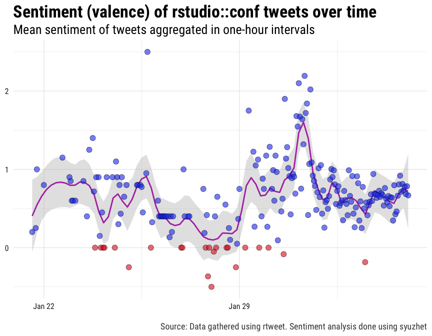
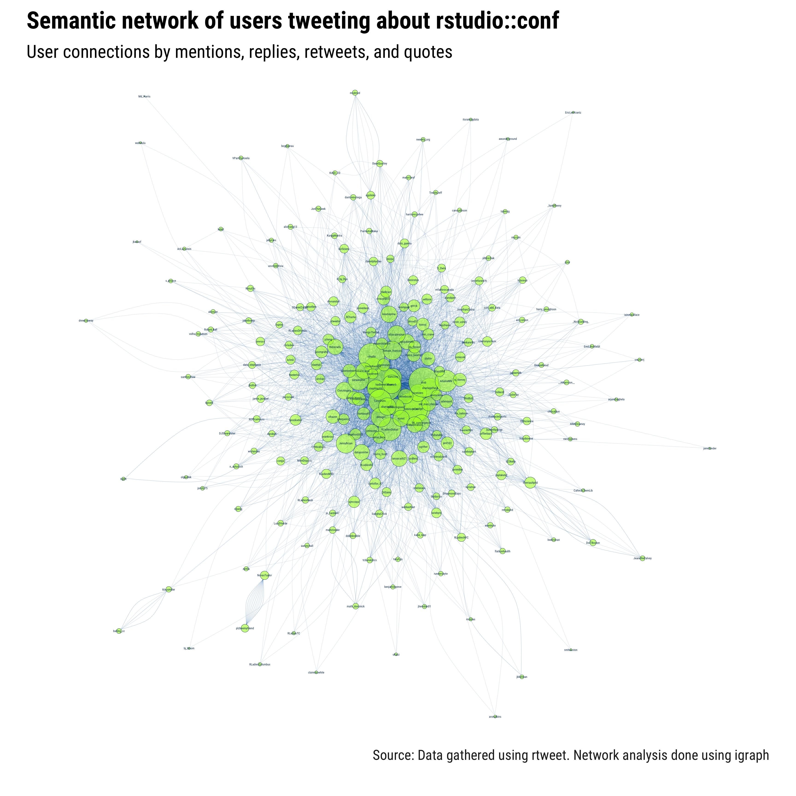
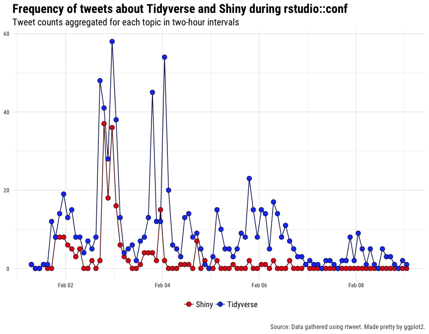
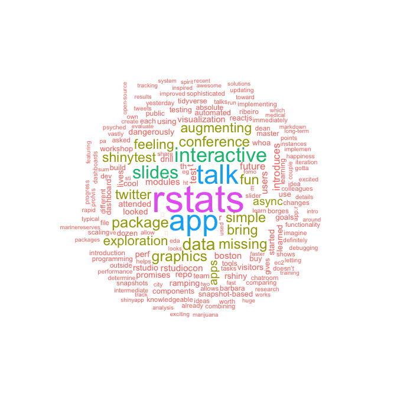
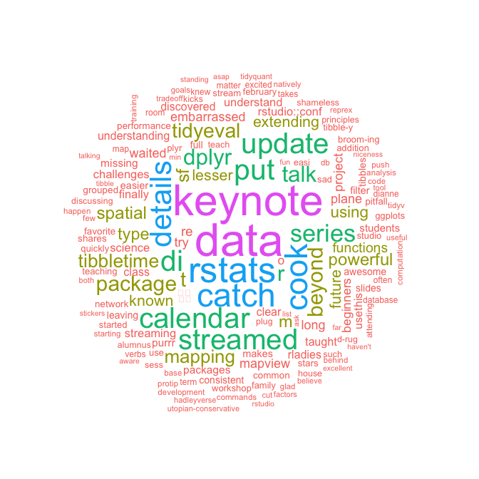

rstudio::conf tweets
================
A repository for tracking [tweets about rstudio::conf 2018](https://twitter.com/hashtag/rstudioconf?f=tweets&vertical=default&src=hash). Read more about the Rstudio conference at [rstudio.com/conference/](https://www.rstudio.com/conference/).

-   [Data](#data)
    -   [rtweet](#rtweet)
-   [Twitter APIs](#twitter-apis)
    -   [Stream](#stream)
    -   [Search](#search)
-   [Explore](#explore)
    -   [Tweet frequency over time](#tweet-frequency-over-time)
    -   [Positive/negative sentiment](#positivenegative-sentiment)
    -   [Semantic networks](#semantic-networks)
    -   [Tidyverse vs. Shiny](#tidyverse-vs.-shiny)
    -   [Word clouds](#word-clouds)

Data
----

Two data collection methods are described in detail below. Hoewver, if you want to skip straight to the data, run the following code:

``` r
## download status IDs file
download.file(
  "https://github.com/mkearney/rstudioconf_tweets/blob/master/data/search-ids.rds?raw=true",
  "rstudioconf_search-ids.rds"
)

## read status IDs fromdownloaded file
ids <- readRDS("rstudioconf_search-ids.rds")

## lookup data associated with status ids
rt <- rtweet::lookup_tweets(ids$status_id)
```

### rtweet

Whether you lookup the status IDs or search/stream new tweets, make sure you've installed the [rtweet](http://rtweet.info) package. The code below will install \[if it's not already\] and load rtweet.

``` r
## install rtweet if not already
if (!requireNamespace("rtweet", quietly = TRUE)) {
  install.packages("rtweet")
}

## load rtweet
library(rtweet)
```

Twitter APIs
------------

There are two easy \[and free\] ways to get lots of Twitter data, filtering by one or more keywords. Each method is described and demonstrated below.

### Stream

The first way is to stream the data (using Twitter's stream API). For example, in the code below, a stream is setup to run continuously from the moment its executed until the Saturday at midnight (to roughly coincide with the end of the conference).

``` r
## set stream time
timeout <- as.numeric(
  difftime(as.POSIXct("2018-02-04 00:00:00"),
  Sys.time(), tz = "US/Pacific", "secs")
)

## search terms
rstudioconf <- c("rstudioconf", "rstudio::conf",
  "rstudioconference", "rstudioconference18",
  "rstudioconference2018", "rstudio18",
  "rstudioconf18", "rstudioconf2018",
  "rstudio::conf18", "rstudio::conf2018")

## name of file to save output
json_file <- file.path("data", "stream.json")

## stream the tweets and write to "data/stream.json"
stream_tweets(
  q = paste(rstudioconf, collapse = ","),
  timeout = timeout,
  file_name = json_file,
  parse = FALSE
)

## parse json data and convert to tibble
rt <- parse_stream(json_file)
```

### Search

The second easy way to gather Twitter data using one or more keywords is to search for the data (using Twitter's REST API). Unlike streaming, searching makes it possible to go back in time. Unfortunately, Twitter sets a rather restrictive cap–roughly nine days–on how far back you can go. Regardless, searching for tweets is often the preferred method. For example, the code below is setup in such a way that it can be executed once \[or even several times\] a day throughout the conference.

``` r
## search terms
rstudioconf <- c("rstudioconf", "rstudio::conf",
  "rstudioconference", "rstudioconference18",
  "rstudioconference2018", "rstudio18",
  "rstudioconf18", "rstudioconf2018",
  "rstudio::conf18", "rstudio::conf2018")

## use since_id from previous search (if exists)
if (file.exists(file.path("data", "search.rds"))) {
  since_id <- readRDS(file.path("data", "search.rds"))
  since_id <- since_id$status_id[1]
} else {
  since_id <- NULL
}

## search for up to 100,000 tweets mentionging rstudio::conf
rt <- search_tweets(
  paste(rstudioconf, collapse = " OR "),
  n = 1e5, verbose = FALSE,
  since_id = since_id,
  retryonratelimit = TRUE
)

## if there's already a search data file saved, then read it in,
## drop the duplicates, and then update the `rt` data object
if (file.exists(file.path("data", "search.rds"))) {

  ## bind rows (for tweets AND users data)
  rt <- do_call_rbind(
    list(rt, readRDS(file.path("data", "search.rds"))))

  ## determine whether each observation has a unique status ID
  kp <- !duplicated(rt$status_id)

  ## only keep rows (observations) with unique status IDs
  users <- users_data(rt)[kp, ]

  ## the rows of users should correspond with the tweets
  rt <- rt[kp, ]

  ## restore as users attribute
  attr(rt, "users") <- users
}

## save the data
saveRDS(rt, file.path("data", "search.rds"))

## save shareable data (only status_ids)
saveRDS(rt[, "status_id"], file.path("data", "search-ids.rds"))
```

Explore
-------

To explore the Twitter data, go ahead and load the [tidyverse](http://tidyverse.org) packages.

``` r
suppressPackageStartupMessages(library(tidyverse))
```

### Tweet frequency over time

In the code below, the data is summarized into a time series-like data frame and then plotted in order depict the frequency of tweets–aggregated using 2-hour intevals–about rstudio::conf over time.

``` r
rt %>%
  filter(created_at > "2018-01-29") %>%
  ts_plot("2 hours", color = "transparent") +
  geom_smooth(method = "loess", se = FALSE, span = .1,
  size = 2, colour = "#0066aa") +
  geom_point(size = 5,
    shape = 21, fill = "#ADFF2F99", colour = "#000000dd") +
  theme_minimal(base_size = 15, base_family = "Roboto Condensed") +
  theme(axis.text = element_text(colour = "#222222"),
    plot.title = element_text(size = rel(1.7), face = "bold"),
    plot.subtitle = element_text(size = rel(1.3)),
    plot.caption = element_text(colour = "#444444")) +
  labs(title = "Frequency of tweets about rstudio::conf over time",
    subtitle = "Twitter status counts aggregated using two-hour intervals",
    caption = "\n\nSource: Data gathered via Twitter's standard `search/tweets` API using rtweet",
    x = NULL, y = NULL)
```

<p align="center">

</p>
 

### Positive/negative sentiment

Next, some sentiment analysis of the tweets so far.

``` r
## clean up the text a bit (rm mentions and links)
rt$text2 <- gsub(
  "^RT:?\\s{0,}|#|@\\S+|https?[[:graph:]]+", "", rt$text)
## convert to lower case
rt$text2 <- tolower(rt$text2)
## trim extra white space
rt$text2 <- gsub("^\\s{1,}|\\s{1,}$", "", rt$text2)
rt$text2 <- gsub("\\s{2,}", " ", rt$text2)

## estimate pos/neg sentiment for each tweet
rt$sentiment <- syuzhet::get_sentiment(rt$text2, "syuzhet")

## write function to round time into rounded var
round_time <- function(x, sec) {
  as.POSIXct(hms::hms(as.numeric(x) %/% sec * sec))
}

## plot by specified time interval (1-hours)
rt %>%
  filter(created_at < "2018-02-05") %>%
  mutate(time = round_time(created_at, 60 * 60)) %>%
  group_by(time) %>%
  summarise(sentiment = mean(sentiment, na.rm = TRUE)) %>%
  mutate(valence = ifelse(sentiment > 0L, "Positive", "Negative")) %>%
  ggplot(aes(x = time, y = sentiment)) +
  geom_smooth(method = "loess", span = .1,
    colour = "#aa11aadd", fill = "#bbbbbb11") +
  geom_point(aes(fill = valence, colour = valence), 
    shape = 21, alpha = .6, size = 3.5) +
  theme_minimal(base_size = 15, base_family = "Roboto Condensed") +
  theme(legend.position = "none",
    axis.text = element_text(colour = "#222222"),
    plot.title = element_text(size = rel(1.7), face = "bold"),
    plot.subtitle = element_text(size = rel(1.3)),
    plot.caption = element_text(colour = "#444444")) +
  scale_fill_manual(
    values = c(Positive = "#2244ee", Negative = "#dd2222")) +
  scale_colour_manual(
    values = c(Positive = "#001155", Negative = "#550000")) +
  labs(x = NULL, y = NULL,
    title = "Sentiment (valence) of rstudio::conf tweets over time",
    subtitle = "Mean sentiment of tweets aggregated in one-hour intervals",
    caption = "\nSource: Data gathered using rtweet. Sentiment analysis done using syuzhet")
```

<p align="center">

</p>
 

### Semantic networks

The code below provides a quick and dirty visualization of the semantic network (connections via retweet, quote, mention, or reply) found in the data.

``` r
## unlist observations into long-form data frame
unlist_df <- function(...) {
  dots <- lapply(list(...), unlist)
  tibble::as_tibble(dots)
}

## iterate by row
row_dfs <- lapply(
  seq_len(nrow(rt)), function(i)
    unlist_df(from_screen_name = rt$screen_name[i],
      reply = rt$reply_to_screen_name[i],
      mention = rt$mentions_screen_name[i],
      quote = rt$quoted_screen_name[i],
      retweet = rt$retweet_screen_name[i])
)

## bind rows, gather (to long), convert to matrix, and filter out NAs
rdf <- dplyr::bind_rows(row_dfs)
rdf <- tidyr::gather(rdf, interaction_type, to_screen_name, -from_screen_name)
mat <- as.matrix(rdf[, -2])
mat <- mat[apply(mat, 1, function(i) !any(is.na(i))), ]

## get rid of self references
mat <- mat[mat[, 1] != mat[, 2], ]

## filter out users who don't appear in RHS at least 3 times
apps1 <- table(mat[, 1])
apps1 <- apps1[apps1 > 1L]
apps2 <- table(mat[, 2])
apps2 <- apps2[apps2 > 1L]
apps <- names(apps1)[names(apps1) %in% names(apps2)]
mat <- mat[mat[, 1] %in% apps & mat[, 2] %in% apps, ]

## create graph object
g <- igraph::graph_from_edgelist(mat)

## calculate size attribute (and transform to fit)
matcols <- factor(c(mat[, 1], mat[, 2]), levels = names(igraph::V(g)))
size <- table(screen_name = matcols)
size <- (log(size) + sqrt(size)) / 3

## reorder freq table
size <- size[match(names(size), names(igraph::V(g)))]

## plot network
par(mar = c(12, 6, 15, 6))
plot(g,
  edge.size = .4,
  curved = FALSE,
  margin = -.05,
  edge.arrow.size = 0,
  edge.arrow.width = 0,
  vertex.color = "#ADFF2F99",
  vertex.size = size,
  vertex.frame.color = "#003366",
  vertex.label.color = "#003366",
  vertex.label.cex = .8,
  vertex.label.family = "Roboto Condensed",
  edge.color = "#0066aa",
  edge.width = .2,
  main = "")
par(mar = c(9, 6, 9, 6))
title("Semantic network of users tweeting about rstudio::conf",
  adj = 0, family = "Roboto Condensed", cex.main = 6.5)
mtext("Source: Data gathered using rtweet. Network analysis done using igraph",
  side = 1, line = 0, adj = 1.0, cex = 3.8,
  family = "Roboto Condensed", col = "#222222")
mtext("User connections by mentions, replies, retweets, and quotes",
  side = 3, line = -4.25, adj = 0,
  family = "Roboto Condensed", cex = 4.9)
```

<p align="center">

</p>
 

Ideally, the network visualization would be an interactive, searchable graphic. Since it's not, I've printed out the node size values below.

``` r
nodes <- as_tibble(sort(size, decreasing = TRUE))
nodes$rank <- seq_len(nrow(nodes))
nodes$screen_name <- paste0(
  '<a href="https://twitter.com/', nodes$screen_name, 
  '">@', nodes$screen_name, '</a>')
dplyr::select(nodes, rank, screen_name, log_n = n)
```

|  rank| screen\_name                                                         |      log\_n|
|-----:|:---------------------------------------------------------------------|-----------:|
|     1| <a href="https://twitter.com/hadleywickham">@hadleywickham</a>       |  11.0164053|
|     2| <a href="https://twitter.com/robinson_es">@robinson\_es</a>          |  10.7205729|
|     3| <a href="https://twitter.com/drob">@drob</a>                         |   9.8275619|
|     4| <a href="https://twitter.com/rstudio">@rstudio</a>                   |   9.0122754|
|     5| <a href="https://twitter.com/juliasilge">@juliasilge</a>             |   8.3156539|
|     6| <a href="https://twitter.com/RLadiesGlobal">@RLadiesGlobal</a>       |   7.4782542|
|     7| <a href="https://twitter.com/LucyStats">@LucyStats</a>               |   7.4112162|
|     8| <a href="https://twitter.com/AmeliaMN">@AmeliaMN</a>                 |   7.1228108|
|     9| <a href="https://twitter.com/dataandme">@dataandme</a>               |   7.0632396|
|    10| <a href="https://twitter.com/sharlagelfand">@sharlagelfand</a>       |   6.7674473|
|    11| <a href="https://twitter.com/d4tagirl">@d4tagirl</a>                 |   6.7547438|
|    12| <a href="https://twitter.com/JennyBryan">@JennyBryan</a>             |   6.4124132|
|    13| <a href="https://twitter.com/Voovarb">@Voovarb</a>                   |   6.0284818|
|    14| <a href="https://twitter.com/romain_francois">@romain\_francois</a>  |   6.0284818|
|    15| <a href="https://twitter.com/ellisvalentiner">@ellisvalentiner</a>   |   5.9837260|
|    16| <a href="https://twitter.com/EmilyRiederer">@EmilyRiederer</a>       |   5.7999183|
|    17| <a href="https://twitter.com/CivicAngela">@CivicAngela</a>           |   5.7842362|
|    18| <a href="https://twitter.com/sharon000">@sharon000</a>               |   5.7842362|
|    19| <a href="https://twitter.com/sconvers">@sconvers</a>                 |   5.7049294|
|    20| <a href="https://twitter.com/astroeringrand">@astroeringrand</a>     |   5.6888842|
|    21| <a href="https://twitter.com/eamcvey">@eamcvey</a>                   |   5.6888842|
|    22| <a href="https://twitter.com/stephhazlitt">@stephhazlitt</a>         |   5.6403685|
|    23| <a href="https://twitter.com/kearneymw">@kearneymw</a>               |   5.5581979|
|    24| <a href="https://twitter.com/SK_convergence">@SK\_convergence</a>    |   5.5248529|
|    25| <a href="https://twitter.com/visnut">@visnut</a>                     |   5.3186034|
|    26| <a href="https://twitter.com/CMastication">@CMastication</a>         |   5.2831274|
|    27| <a href="https://twitter.com/kara_woo">@kara\_woo</a>                |   5.2652635|
|    28| <a href="https://twitter.com/datapointier">@datapointier</a>         |   5.1929426|
|    29| <a href="https://twitter.com/thmscwlls">@thmscwlls</a>               |   5.1562458|
|    30| <a href="https://twitter.com/tanyacash21">@tanyacash21</a>           |   5.1191779|
|    31| <a href="https://twitter.com/njogukennly">@njogukennly</a>           |   5.0056364|
|    32| <a href="https://twitter.com/old_man_chester">@old\_man\_chester</a> |   4.8683901|
|    33| <a href="https://twitter.com/minebocek">@minebocek</a>               |   4.8281541|
|    34| <a href="https://twitter.com/elhazen">@elhazen</a>                   |   4.5540652|
|    35| <a href="https://twitter.com/CorradoLanera">@CorradoLanera</a>       |   4.5097581|
|    36| <a href="https://twitter.com/ijlyttle">@ijlyttle</a>                 |   4.4192141|
|    37| <a href="https://twitter.com/AlexisLNorris">@AlexisLNorris</a>       |   4.3961566|
|    38| <a href="https://twitter.com/kierisi">@kierisi</a>                   |   4.3961566|
|    39| <a href="https://twitter.com/juliesquid">@juliesquid</a>             |   4.3961566|
|    40| <a href="https://twitter.com/malco_bearhat">@malco\_bearhat</a>      |   4.3259141|
|    41| <a href="https://twitter.com/thomas_mock">@thomas\_mock</a>          |   4.3259141|
|    42| <a href="https://twitter.com/nj_tierney">@nj\_tierney</a>            |   4.3021301|
|    43| <a href="https://twitter.com/jimhester_">@jimhester\_</a>            |   4.3021301|
|    44| <a href="https://twitter.com/edzerpebesma">@edzerpebesma</a>         |   4.3021301|
|    45| <a href="https://twitter.com/thomasp85">@thomasp85</a>               |   4.2296099|
|    46| <a href="https://twitter.com/ds_floresf">@ds\_floresf</a>            |   4.2296099|
|    47| <a href="https://twitter.com/rudeboybert">@rudeboybert</a>           |   4.2050318|
|    48| <a href="https://twitter.com/dvaughan32">@dvaughan32</a>             |   4.1045644|
|    49| <a href="https://twitter.com/shermstats">@shermstats</a>             |   4.0267962|
|    50| <a href="https://twitter.com/jent103">@jent103</a>                   |   4.0267962|
|    51| <a href="https://twitter.com/grrrck">@grrrck</a>                     |   3.9195611|
|    52| <a href="https://twitter.com/theRcast">@theRcast</a>                 |   3.9195611|
|    53| <a href="https://twitter.com/jasongrahn">@jasongrahn</a>             |   3.8920720|
|    54| <a href="https://twitter.com/_RCharlie">@\_RCharlie</a>              |   3.8920720|
|    55| <a href="https://twitter.com/alice_data">@alice\_data</a>            |   3.8642952|
|    56| <a href="https://twitter.com/jafflerbach">@jafflerbach</a>           |   3.8362222|
|    57| <a href="https://twitter.com/ajmcoqui">@ajmcoqui</a>                 |   3.8362222|
|    58| <a href="https://twitter.com/therriaultphd">@therriaultphd</a>       |   3.8078439|
|    59| <a href="https://twitter.com/Bluelion0305">@Bluelion0305</a>         |   3.7791511|
|    60| <a href="https://twitter.com/sgrifter">@sgrifter</a>                 |   3.7501339|
|    61| <a href="https://twitter.com/RLadiesBA">@RLadiesBA</a>               |   3.7501339|
|    62| <a href="https://twitter.com/yutannihilation">@yutannihilation</a>   |   3.7207821|
|    63| <a href="https://twitter.com/taraskaduk">@taraskaduk</a>             |   3.6910847|
|    64| <a href="https://twitter.com/cantoflor_87">@cantoflor\_87</a>        |   3.6910847|
|    65| <a href="https://twitter.com/jonmcalder">@jonmcalder</a>             |   3.6910847|
|    66| <a href="https://twitter.com/jcheng">@jcheng</a>                     |   3.6306068|
|    67| <a href="https://twitter.com/nic_crane">@nic\_crane</a>              |   3.5998014|
|    68| <a href="https://twitter.com/seankross">@seankross</a>               |   3.5998014|
|    69| <a href="https://twitter.com/ma_salmon">@ma\_salmon</a>              |   3.5686007|
|    70| <a href="https://twitter.com/DataActivism">@DataActivism</a>         |   3.5369905|
|    71| <a href="https://twitter.com/cpsievert">@cpsievert</a>               |   3.5049555|
|    72| <a href="https://twitter.com/gdequeiroz">@gdequeiroz</a>             |   3.5049555|
|    73| <a href="https://twitter.com/kevin_ushey">@kevin\_ushey</a>          |   3.5049555|
|    74| <a href="https://twitter.com/daattali">@daattali</a>                 |   3.4724797|
|    75| <a href="https://twitter.com/Dorris_Scott">@Dorris\_Scott</a>        |   3.4724797|
|    76| <a href="https://twitter.com/Blair09M">@Blair09M</a>                 |   3.4395462|
|    77| <a href="https://twitter.com/PyDataBA">@PyDataBA</a>                 |   3.3722321|
|    78| <a href="https://twitter.com/sellorm">@sellorm</a>                   |   3.3722321|
|    79| <a href="https://twitter.com/claytonyochum">@claytonyochum</a>       |   3.3378116|
|    80| <a href="https://twitter.com/simecek">@simecek</a>                   |   3.3378116|
|    81| <a href="https://twitter.com/MangoTheCat">@MangoTheCat</a>           |   3.3028532|
|    82| <a href="https://twitter.com/lariebyrd">@lariebyrd</a>               |   3.2673334|
|    83| <a href="https://twitter.com/krlmlr">@krlmlr</a>                     |   3.2312268|
|    84| <a href="https://twitter.com/jessenleon">@jessenleon</a>             |   3.1945063|
|    85| <a href="https://twitter.com/paylakatel">@paylakatel</a>             |   3.1191041|
|    86| <a href="https://twitter.com/drvnanduri">@drvnanduri</a>             |   3.0803567|
|    87| <a href="https://twitter.com/bhive01">@bhive01</a>                   |   3.0803567|
|    88| <a href="https://twitter.com/zevross">@zevross</a>                   |   3.0408634|
|    89| <a href="https://twitter.com/RLadiesMVD">@RLadiesMVD</a>             |   3.0408634|
|    90| <a href="https://twitter.com/aindap">@aindap</a>                     |   3.0005839|
|    91| <a href="https://twitter.com/ucdlevy">@ucdlevy</a>                   |   3.0005839|
|    92| <a href="https://twitter.com/ntweetor">@ntweetor</a>                 |   3.0005839|
|    93| <a href="https://twitter.com/tnederlof">@tnederlof</a>               |   2.9594743|
|    94| <a href="https://twitter.com/JonathanZadra">@JonathanZadra</a>       |   2.9594743|
|    95| <a href="https://twitter.com/Denironyx">@Denironyx</a>               |   2.9594743|
|    96| <a href="https://twitter.com/just_add_data">@just\_add\_data</a>     |   2.9594743|
|    97| <a href="https://twitter.com/OilGains">@OilGains</a>                 |   2.9594743|
|    98| <a href="https://twitter.com/duto_guerra">@duto\_guerra</a>          |   2.9174869|
|    99| <a href="https://twitter.com/dmi3k">@dmi3k</a>                       |   2.9174869|
|   100| <a href="https://twitter.com/jarvmiller">@jarvmiller</a>             |   2.9174869|
|   101| <a href="https://twitter.com/javierluraschi">@javierluraschi</a>     |   2.8745690|
|   102| <a href="https://twitter.com/danielphadley">@danielphadley</a>       |   2.8745690|
|   103| <a href="https://twitter.com/bizScienc">@bizScienc</a>               |   2.8745690|
|   104| <a href="https://twitter.com/SanghaChick">@SanghaChick</a>           |   2.8745690|
|   105| <a href="https://twitter.com/CVWickham">@CVWickham</a>               |   2.8745690|
|   106| <a href="https://twitter.com/nicoleradziwill">@nicoleradziwill</a>   |   2.8745690|
|   107| <a href="https://twitter.com/patsellers">@patsellers</a>             |   2.8306631|
|   108| <a href="https://twitter.com/RhoBott">@RhoBott</a>                   |   2.8306631|
|   109| <a href="https://twitter.com/RLadiesOrlando">@RLadiesOrlando</a>     |   2.8306631|
|   110| <a href="https://twitter.com/deekareithi">@deekareithi</a>           |   2.8306631|
|   111| <a href="https://twitter.com/GioraSimchoni">@GioraSimchoni</a>       |   2.7857054|
|   112| <a href="https://twitter.com/BaumerBen">@BaumerBen</a>               |   2.7857054|
|   113| <a href="https://twitter.com/mmmpork">@mmmpork</a>                   |   2.7857054|
|   114| <a href="https://twitter.com/alandipert">@alandipert</a>             |   2.7396253|
|   115| <a href="https://twitter.com/NovasTaylor">@NovasTaylor</a>           |   2.7396253|
|   116| <a href="https://twitter.com/millerdl">@millerdl</a>                 |   2.7396253|
|   117| <a href="https://twitter.com/sheilasaia">@sheilasaia</a>             |   2.7396253|
|   118| <a href="https://twitter.com/RLadiesNYC">@RLadiesNYC</a>             |   2.6923444|
|   119| <a href="https://twitter.com/conjja">@conjja</a>                     |   2.6923444|
|   120| <a href="https://twitter.com/SHaymondSays">@SHaymondSays</a>         |   2.6437752|
|   121| <a href="https://twitter.com/PinnacleSports">@PinnacleSports</a>     |   2.6437752|
|   122| <a href="https://twitter.com/MineDogucu">@MineDogucu</a>             |   2.5938194|
|   123| <a href="https://twitter.com/Nujcharee">@Nujcharee</a>               |   2.5938194|
|   124| <a href="https://twitter.com/S_Owla">@S\_Owla</a>                    |   2.5938194|
|   125| <a href="https://twitter.com/theotheredgar">@theotheredgar</a>       |   2.5938194|
|   126| <a href="https://twitter.com/chrisderv">@chrisderv</a>               |   2.5938194|
|   127| <a href="https://twitter.com/mfairbrocanada">@mfairbrocanada</a>     |   2.5938194|
|   128| <a href="https://twitter.com/plzbeemyfriend">@plzbeemyfriend</a>     |   2.5423660|
|   129| <a href="https://twitter.com/dnlmc">@dnlmc</a>                       |   2.5423660|
|   130| <a href="https://twitter.com/egolinko">@egolinko</a>                 |   2.5423660|
|   131| <a href="https://twitter.com/data_stephanie">@data\_stephanie</a>    |   2.4892894|
|   132| <a href="https://twitter.com/jabbertalk">@jabbertalk</a>             |   2.4892894|
|   133| <a href="https://twitter.com/jamie_jezebel">@jamie\_jezebel</a>      |   2.4892894|
|   134| <a href="https://twitter.com/OHIscience">@OHIscience</a>             |   2.4892894|
|   135| <a href="https://twitter.com/webbedfeet">@webbedfeet</a>             |   2.4344460|
|   136| <a href="https://twitter.com/ParmutiaMakui">@ParmutiaMakui</a>       |   2.3776708|
|   137| <a href="https://twitter.com/R_by_Ryo">@R\_by\_Ryo</a>               |   2.3776708|
|   138| <a href="https://twitter.com/SDanielZafar1">@SDanielZafar1</a>       |   2.3776708|
|   139| <a href="https://twitter.com/hrbrmstr">@hrbrmstr</a>                 |   2.3776708|
|   140| <a href="https://twitter.com/LuisDVerde">@LuisDVerde</a>             |   2.3187730|
|   141| <a href="https://twitter.com/_jwinget">@\_jwinget</a>                |   2.3187730|
|   142| <a href="https://twitter.com/ROfficeHours">@ROfficeHours</a>         |   2.2575296|
|   143| <a href="https://twitter.com/rweekly_org">@rweekly\_org</a>          |   2.2575296|
|   144| <a href="https://twitter.com/b23kelly">@b23kelly</a>                 |   2.2575296|
|   145| <a href="https://twitter.com/kyrietree">@kyrietree</a>               |   2.2575296|
|   146| <a href="https://twitter.com/hugobowne">@hugobowne</a>               |   2.2575296|
|   147| <a href="https://twitter.com/ibddoctor">@ibddoctor</a>               |   2.1936778|
|   148| <a href="https://twitter.com/hspter">@hspter</a>                     |   2.1936778|
|   149| <a href="https://twitter.com/jhollist">@jhollist</a>                 |   2.1936778|
|   150| <a href="https://twitter.com/jakethomp">@jakethomp</a>               |   2.1936778|
|   151| <a href="https://twitter.com/markroepke">@markroepke</a>             |   2.1936778|
|   152| <a href="https://twitter.com/pacocuak">@pacocuak</a>                 |   2.1936778|
|   153| <a href="https://twitter.com/DaveQuartey">@DaveQuartey</a>           |   2.1269049|
|   154| <a href="https://twitter.com/DoITBoston">@DoITBoston</a>             |   2.1269049|
|   155| <a href="https://twitter.com/wmlandau">@wmlandau</a>                 |   2.1269049|
|   156| <a href="https://twitter.com/RLadiesColumbus">@RLadiesColumbus</a>   |   2.1269049|
|   157| <a href="https://twitter.com/RLadiesNash">@RLadiesNash</a>           |   2.1269049|
|   158| <a href="https://twitter.com/rick_pack2">@rick\_pack2</a>            |   2.0568335|
|   159| <a href="https://twitter.com/jo_hardin47">@jo\_hardin47</a>          |   2.0568335|
|   160| <a href="https://twitter.com/butterflyology">@butterflyology</a>     |   2.0568335|
|   161| <a href="https://twitter.com/RiinuOts">@RiinuOts</a>                 |   2.0568335|
|   162| <a href="https://twitter.com/darokun">@darokun</a>                   |   2.0568335|
|   163| <a href="https://twitter.com/klausmiller">@klausmiller</a>           |   1.9830028|
|   164| <a href="https://twitter.com/dantonnoriega">@dantonnoriega</a>       |   1.9830028|
|   165| <a href="https://twitter.com/katie_leap">@katie\_leap</a>            |   1.9830028|
|   166| <a href="https://twitter.com/kpivert">@kpivert</a>                   |   1.9830028|
|   167| <a href="https://twitter.com/brad_cannell">@brad\_cannell</a>        |   1.9830028|
|   168| <a href="https://twitter.com/dobbleobble">@dobbleobble</a>           |   1.9830028|
|   169| <a href="https://twitter.com/_ColinFay">@\_ColinFay</a>              |   1.9830028|
|   170| <a href="https://twitter.com/math_dominick">@math\_dominick</a>      |   1.9048400|
|   171| <a href="https://twitter.com/RobynLBall">@RobynLBall</a>             |   1.9048400|
|   172| <a href="https://twitter.com/ericcolson">@ericcolson</a>             |   1.9048400|
|   173| <a href="https://twitter.com/KurggMantra">@KurggMantra</a>           |   1.9048400|
|   174| <a href="https://twitter.com/tcbanalytics">@tcbanalytics</a>         |   1.9048400|
|   175| <a href="https://twitter.com/flatironhealth">@flatironhealth</a>     |   1.8216209|
|   176| <a href="https://twitter.com/eirenkate">@eirenkate</a>               |   1.8216209|
|   177| <a href="https://twitter.com/revodavid">@revodavid</a>               |   1.8216209|
|   178| <a href="https://twitter.com/harrismcgehee">@harrismcgehee</a>       |   1.7324082|
|   179| <a href="https://twitter.com/jherndon01">@jherndon01</a>             |   1.7324082|
|   180| <a href="https://twitter.com/_NickGolding_">@\_NickGolding\_</a>     |   1.7324082|
|   181| <a href="https://twitter.com/samhinshaw">@samhinshaw</a>             |   1.7324082|
|   182| <a href="https://twitter.com/DJShearwater">@DJShearwater</a>         |   1.7324082|
|   183| <a href="https://twitter.com/runnersbyte">@runnersbyte</a>           |   1.7324082|
|   184| <a href="https://twitter.com/ImagineBos">@ImagineBos</a>             |   1.7324082|
|   185| <a href="https://twitter.com/modmed">@modmed</a>                     |   1.7324082|
|   186| <a href="https://twitter.com/rdpeng">@rdpeng</a>                     |   1.7324082|
|   187| <a href="https://twitter.com/JonTheGeek">@JonTheGeek</a>             |   1.7324082|
|   188| <a href="https://twitter.com/chrisalbon">@chrisalbon</a>             |   1.7324082|
|   189| <a href="https://twitter.com/n_ashutosh">@n\_ashutosh</a>            |   1.7324082|
|   190| <a href="https://twitter.com/jblistman">@jblistman</a>               |   1.6359562|
|   191| <a href="https://twitter.com/balling_cc">@balling\_cc</a>            |   1.6359562|
|   192| <a href="https://twitter.com/__mharrison__">@\_\_mharrison\_\_</a>   |   1.6359562|
|   193| <a href="https://twitter.com/TrestleJeff">@TrestleJeff</a>           |   1.6359562|
|   194| <a href="https://twitter.com/EarlGlynn">@EarlGlynn</a>               |   1.6359562|
|   195| <a href="https://twitter.com/OmniaRaouf">@OmniaRaouf</a>             |   1.6359562|
|   196| <a href="https://twitter.com/jdblischak">@jdblischak</a>             |   1.6359562|
|   197| <a href="https://twitter.com/JeanetheFalvey">@JeanetheFalvey</a>     |   1.6359562|
|   198| <a href="https://twitter.com/harry_seunghoon">@harry\_seunghoon</a>  |   1.6359562|
|   199| <a href="https://twitter.com/alichiang13">@alichiang13</a>           |   1.6359562|
|   200| <a href="https://twitter.com/volha_tryputsen">@volha\_tryputsen</a>  |   1.5305538|
|   201| <a href="https://twitter.com/abresler">@abresler</a>                 |   1.5305538|
|   202| <a href="https://twitter.com/aaronchall">@aaronchall</a>             |   1.5305538|
|   203| <a href="https://twitter.com/AllenDowney">@AllenDowney</a>           |   1.5305538|
|   204| <a href="https://twitter.com/tonyfujs">@tonyfujs</a>                 |   1.5305538|
|   205| <a href="https://twitter.com/maryclaryf">@maryclaryf</a>             |   1.5305538|
|   206| <a href="https://twitter.com/uncmbbtrivia">@uncmbbtrivia</a>         |   1.5305538|
|   207| <a href="https://twitter.com/KirkD_CO">@KirkD\_CO</a>                |   1.4137497|
|   208| <a href="https://twitter.com/rsangole">@rsangole</a>                 |   1.4137497|
|   209| <a href="https://twitter.com/msciain">@msciain</a>                   |   1.4137497|
|   210| <a href="https://twitter.com/jebyrnes">@jebyrnes</a>                 |   1.4137497|
|   211| <a href="https://twitter.com/ledell">@ledell</a>                     |   1.4137497|
|   212| <a href="https://twitter.com/ben_d_best">@ben\_d\_best</a>           |   1.4137497|
|   213| <a href="https://twitter.com/canoodleson">@canoodleson</a>           |   1.4137497|
|   214| <a href="https://twitter.com/benjamingreve">@benjamingreve</a>       |   1.4137497|
|   215| <a href="https://twitter.com/tonmcg">@tonmcg</a>                     |   1.4137497|
|   216| <a href="https://twitter.com/zymla">@zymla</a>                       |   1.4137497|
|   217| <a href="https://twitter.com/strnr">@strnr</a>                       |   1.2818353|
|   218| <a href="https://twitter.com/LauraBBalzer">@LauraBBalzer</a>         |   1.2818353|
|   219| <a href="https://twitter.com/JTLewis5">@JTLewis5</a>                 |   1.2818353|
|   220| <a href="https://twitter.com/clairemcwhite">@clairemcwhite</a>       |   1.2818353|
|   221| <a href="https://twitter.com/s_pearce">@s\_pearce</a>                |   1.2818353|
|   222| <a href="https://twitter.com/jomilo75">@jomilo75</a>                 |   1.2818353|
|   223| <a href="https://twitter.com/nwstephens">@nwstephens</a>             |   1.2818353|
|   224| <a href="https://twitter.com/Emil_Hvitfeldt">@Emil\_Hvitfeldt</a>    |   1.2818353|
|   225| <a href="https://twitter.com/kwbroman">@kwbroman</a>                 |   1.2818353|
|   226| <a href="https://twitter.com/VParrillaAixela">@VParrillaAixela</a>   |   1.2818353|
|   227| <a href="https://twitter.com/ClausWilke">@ClausWilke</a>             |   1.1287648|
|   228| <a href="https://twitter.com/sgpln">@sgpln</a>                       |   1.1287648|
|   229| <a href="https://twitter.com/lorenzwalthert">@lorenzwalthert</a>     |   1.1287648|
|   230| <a href="https://twitter.com/hoxo_m">@hoxo\_m</a>                    |   1.1287648|
|   231| <a href="https://twitter.com/obergr">@obergr</a>                     |   1.1287648|
|   232| <a href="https://twitter.com/drewconway">@drewconway</a>             |   1.1287648|
|   233| <a href="https://twitter.com/iainmwallace">@iainmwallace</a>         |   1.1287648|
|   234| <a href="https://twitter.com/arjunsbaghela">@arjunsbaghela</a>       |   1.1287648|
|   235| <a href="https://twitter.com/_lionelhenry">@\_lionelhenry</a>        |   1.1287648|
|   236| <a href="https://twitter.com/olgavitek">@olgavitek</a>               |   1.1287648|
|   237| <a href="https://twitter.com/crozierrj">@crozierrj</a>               |   1.1287648|
|   238| <a href="https://twitter.com/msimas">@msimas</a>                     |   1.1287648|
|   239| <a href="https://twitter.com/CaltechChemLib">@CaltechChemLib</a>     |   1.1287648|
|   240| <a href="https://twitter.com/AriLamstein">@AriLamstein</a>           |   1.1287648|
|   241| <a href="https://twitter.com/bogdanrau">@bogdanrau</a>               |   1.1287648|
|   242| <a href="https://twitter.com/RLadiesTC">@RLadiesTC</a>               |   1.1287648|
|   243| <a href="https://twitter.com/jduckles">@jduckles</a>                 |   0.9435544|
|   244| <a href="https://twitter.com/Md_Harris">@Md\_Harris</a>              |   0.9435544|
|   245| <a href="https://twitter.com/aronatkins">@aronatkins</a>             |   0.9435544|
|   246| <a href="https://twitter.com/awunderground">@awunderground</a>       |   0.9435544|
|   247| <a href="https://twitter.com/ukacz">@ukacz</a>                       |   0.9435544|
|   248| <a href="https://twitter.com/itsrainingdata">@itsrainingdata</a>     |   0.9435544|
|   249| <a href="https://twitter.com/EricLeeKrantz">@EricLeeKrantz</a>       |   0.7024536|
|   250| <a href="https://twitter.com/PeterSForbes">@PeterSForbes</a>         |   0.7024536|
|   251| <a href="https://twitter.com/wahalulu">@wahalulu</a>                 |   0.7024536|
|   252| <a href="https://twitter.com/jkassof">@jkassof</a>                   |   0.7024536|
|   253| <a href="https://twitter.com/nmhouston">@nmhouston</a>               |   0.7024536|
|   254| <a href="https://twitter.com/alathrop">@alathrop</a>                 |   0.7024536|
|   255| <a href="https://twitter.com/bj_bloom">@bj\_bloom</a>                |   0.7024536|
|   256| <a href="https://twitter.com/jaredlander">@jaredlander</a>           |   0.7024536|

### Tidyverse vs. Shiny

This code identifies tweets by topic, detecting mentions of the tidyverse \[packages\] and shiny. It then plots the frequency of those tweets over time.

``` r
rt %>%
  filter(created_at > "2018-02-01") %>%
  mutate(
    text = tolower(text),
    tidyverse = str_detect(
      text, "dplyr|tidyeval|tidyverse|rlang|map|purrr|readr|tibble"),
    shiny = str_detect(text, "shiny|dashboard|interactiv")
  ) %>%
  select(created_at, tidyverse:shiny) %>%
  gather(pkg, mention, -created_at) %>%
  mutate(pkg = factor(pkg, labels = c("Shiny", "Tidyverse"))) %>%
  filter(mention) %>%
  group_by(pkg) %>%
  ts_plot("2 hours") +
  geom_point(shape = 21, size = 3, aes(fill = pkg)) + 
  theme_minimal(base_family = "Roboto Condensed") + 
  scale_x_datetime(timezone = "America/Los_Angelos") + 
  theme(legend.position = "bottom",
    legend.title = element_blank(),
    legend.text = element_text(size = rel(1.1)),
    axis.text = element_text(colour = "#222222"),
    plot.title = element_text(size = rel(1.7), face = "bold"),
    plot.subtitle = element_text(size = rel(1.3)),
    plot.caption = element_text(colour = "#444444")) +
  scale_fill_manual(
    values = c(Tidyverse = "#2244ee", Shiny = "#dd2222")) +
  scale_colour_manual(
    values = c(Tidyverse = "#001155", Shiny = "#550000")) +
  labs(x = NULL, y = NULL,
    title = "Frequency of tweets about Tidyverse and Shiny during rstudio::conf",
    subtitle = "Tweet counts aggregated for each topic in two-hour intervals",
    caption = "\nSource: Data gathered using rtweet. Made pretty by ggplot2.")
```

<p align="center">

</p>
 

### Word clouds

I didn't want to add a bunch more code, so here I'm sourcing the prep work/code I used to get word lists.

``` r
source(file.path("R", "words.R"))
```

#### Shiny word cloud

This first word cloud depicts the most popular non-stopwords used in tweets about Shiny.

``` r
par(mar = c(0, 0, 0, 0))
wordcloud::wordcloud(
  shiny$var, shiny$n, min.freq = 3,
  random.order = FALSE,
  random.color = FALSE,
  colors = gg_cols(5)
)
```

<p align="center">

</p>
 

#### Tidyverse word cloud

The second word cloud depicts the most popular non-stopwords used in tweets about the tidyverse.

``` r
par(mar = c(0, 0, 0, 0))
wordcloud::wordcloud(
  tidyverse$var, tidyverse$n, min.freq = 5,
  random.order = FALSE,
  random.color = FALSE,
  colors = gg_cols(5)
)
```

<p align="center">

</p>
